# Project 1
Phil Abraham

Felipe Ayala

Eve Griggs

Eren Turkmenonglu

## BlackRock Investments Presents:
# Beating the SP500, A Million Dollar Selection Process

BlackRock Investments is comprised of learners and stock market enthusiasts. In this project we worked to create a simple yet sophisticated portfolio that could potentially beat the overall Stock Market. 
We selected Large to Mega Cap stocks in order to utilize low correlation to a high beta to Market relationship.  We forecasted future returns by running a  Monte Carlo Simulation and looking at historical data for a 5-year period.

# Key components for selecting a Portfolio which will outperform the SP500

## Is it possible to outperform the SP500?
Based on our findings, yes the market can be outperformed. We looked at the following comparisons to determine our performance against the SPY:

>>SPY historical vs BLK historical Portfolio

>>SPY Sharpe vs BLK Portfolio Sharpe

>>SPY 5YR MC Sim vs BLK Portfolio  5YR MC Sim

## What does the selection process look like to create the portfolio?
Stock Picking Strategies:

Eve: Technology sector reflecting consumer and industry trends. 

Felipe: Large Cap Stocks / consistent history of dividend yield and growth.

Phil: Large Cap and Mega Cap / Financial Services, Consumer Defensive, Tech, Consumer Cyclical. P/E, Beta, Working Capital and EV/EBITDA

Eren: Enterprise Software, Technology, Entertainment, Pharmaceutical. Comparison analysis with peers using fundamental analysis, stocks that are operating in more than a single industry.

### BLK Final Portfolio Composition:

### Select final Stock portfolio by using a High Beta low Correlation Strategy

### Final Portfolio Composition: 40% SPY and 60% BLK Portfolio. 

## How do our applied metrics determine if the portfolio beats the SP500?
Our goal was to compare historical metrics and run a Monte Carlo Simulation to determine the probability of outperforming the stock market. Below are the selected metrics:

>> Historical Results

>> Daily returns

>> Cumulative Returns

>> Sharpe Ratio

>> 5 yr - MC Simulation: 

>> BLK Portfolio vs SPY

# Understanding the Data: An elaboration on our applied metrics

## Initial portfolio resulted in 28 stocks selected based on team members' decisions. The selected Portfolio (BLK) is reduced from 29 to 15 stocks by running the following data exploration

From the initial selection of 28 stocks it was neccesary to caculate from the historical data for a five year period (approx 11-2015:11-2020) in order to  compare it to the calculated returns of the SP500. 

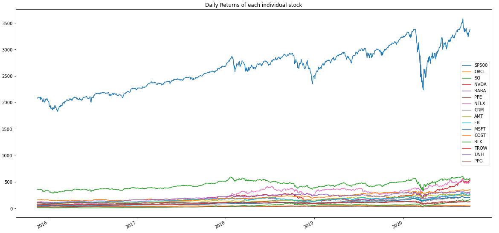

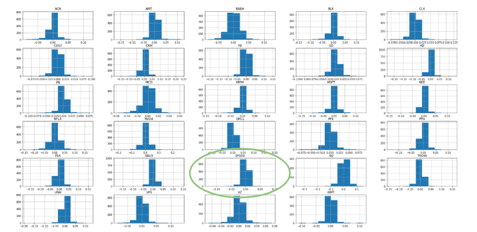

Calculating the covariance and variance for the Initial Portfolio and SP500: 

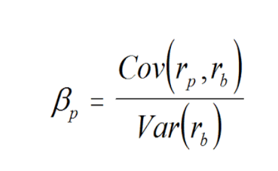

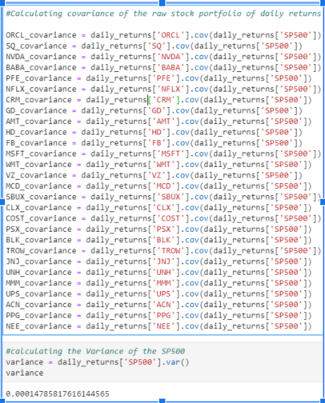

Calculating Beta for Initial portfolio, sorting from lowest to highest:

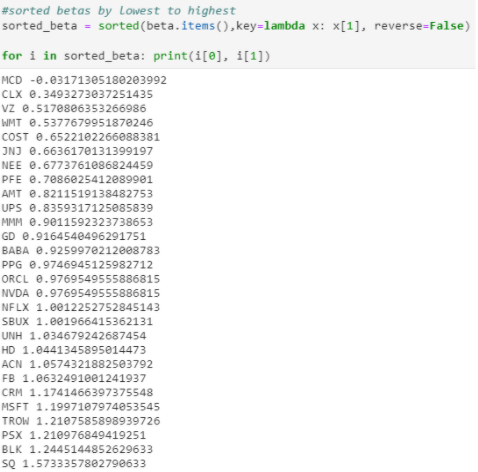

Calculating Correlation of Initial portfolio to SP500

### correlation_of_portfolio = daily_returns.corr()

### correlation_of_portfolio

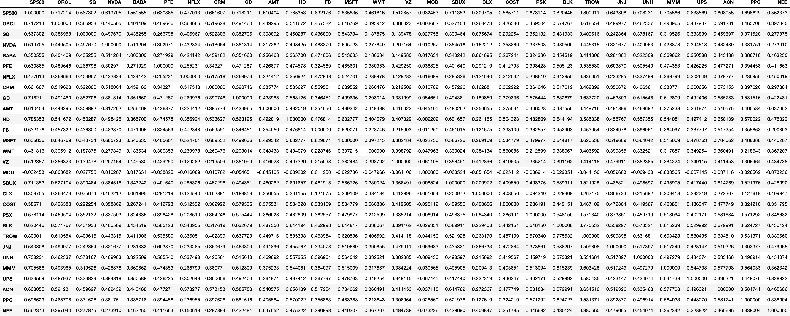

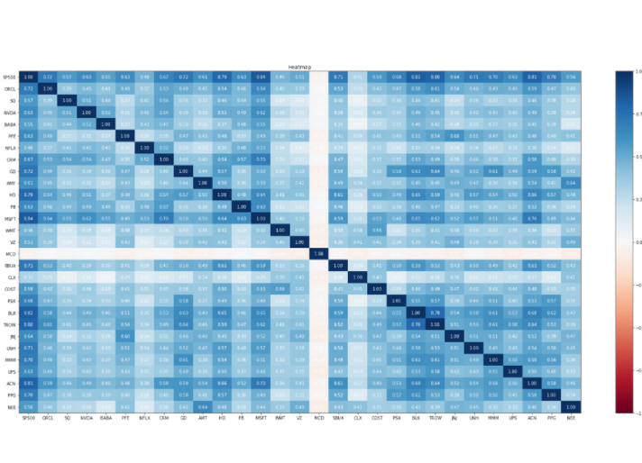

# Final portfolio selection: Low correlation to SP500 and High Beta metric from initial portfolio
Using the lowest correlation to the market and highest beta from our initial 29 stock portfolio, we preselected 15 stocks. However, as an executive decision, we replaced 2 stocks. We removed PSX and SBUX, and added PFE and COST form our raw portfolio. We wanted to capitalize on Costco’s future growth and reduce all exposure to the Oil Industry Sector. Final stock selection from strategy: 
AMT, ORCL, PPG, COST, MSFT, UNH, TROW, BLK, NVDA, FB, BABA, CRM, PFE, NFLX, SQ. 

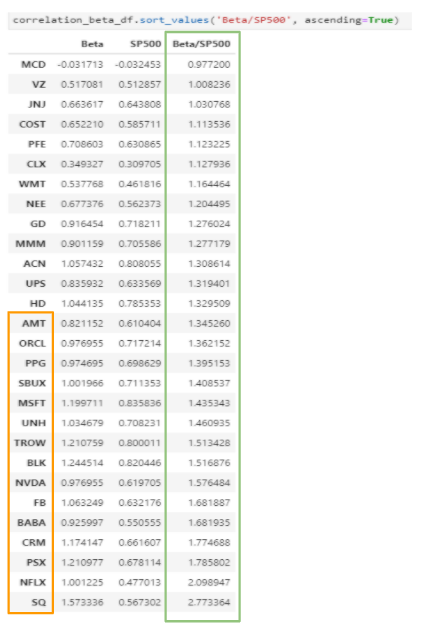

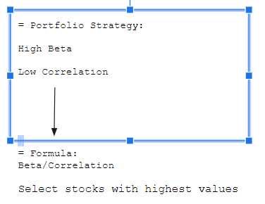

### Final BLK Portfolio composition = (40% SPY + 60% BLK Portfolio) Totaling 16 holdings. 

# Data Results and Findings

## 5 Year MC Simulation Expected Return BLK Port vs SPY

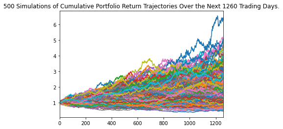

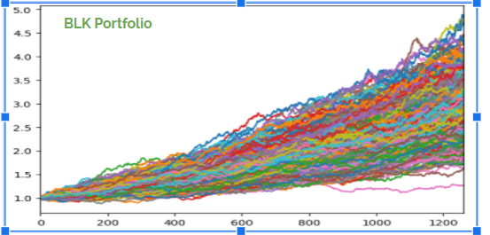

There is a 95% chance that an initial investment of $10,000 in BKL strategy, will end within the range of $ 19,024.21  and $ 42,326.91. This represents 90.24% to 323.26% return in a 5 year period. 
There is a 95% chance Expected Return of a $10,000 initial portfolio investing in SPY will end within the range of $ 7,019.96  and $ 38255.93. This represents -29.81% to 282.55% return in a 5 year period. 

## Sharpe Ratio

>>The sharpe ratio comparisons are favorable for the BLK portfolio, based upon a good ratio above 1, and the SP500 ratio below 1 as sub-optimal.

# The goal of our project was to answer the question: Can we beat the market?
*We used data from open sources as well as API’s to collect the data*. 

*Techniques and applied data manipulation to include Juypter notebooks, pandas and Python to clean and interpret the data and we used FFN to help understand the data*.

*Through analysis and interpretation we determined a portfolio that we felt best offered us a chance to outperform the S&P500* .

 ***Based on historical data and future predictions we determined that it is possible to use the portfolio we created to outperform the market***.{*DISCLAIMER}

* DISCLAIMER: This portfolio was created for the purposes of this project and should not be the sole method of determining stock selections nor should it be viewed as  strong investment method. This portfolio while containing financial analysis worked primarily to highlight the teams coding abilities and not necessarily their ability to pick stocks or guarantee any type of return. The team takes no responsibility or liability if an individual attempts to use this portfolio in order to replicate returns. The team also makes no guarantee that the returns predicted can come true. The team as a collective is not an investment advisor or serve in a advising capacity and should not be viewed as such.
Please speak to a registered Investment professional before making any financial decisions
The team has no affiliation with BlackRock Investment Management Company nor do we represent their views. The team name was predetermined and the team used it solely in a identifying capacity.
Past results DO NOT guarantee future returns.

